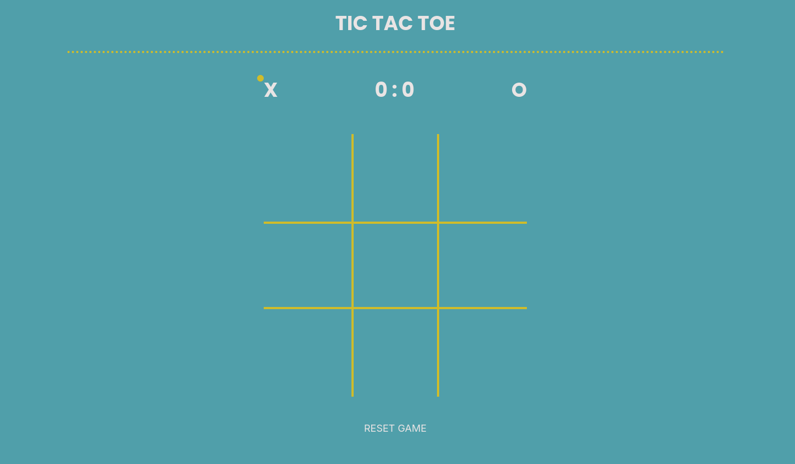
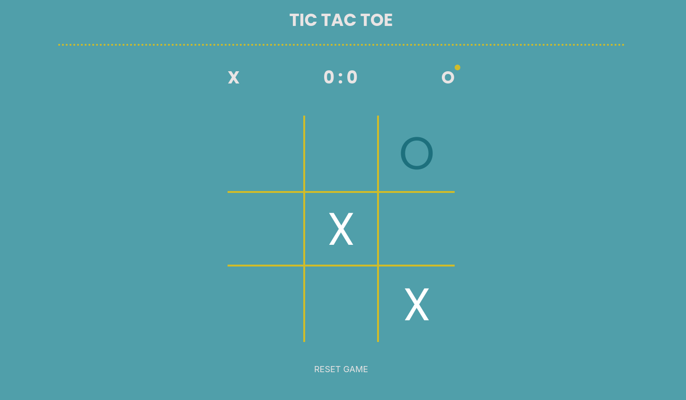
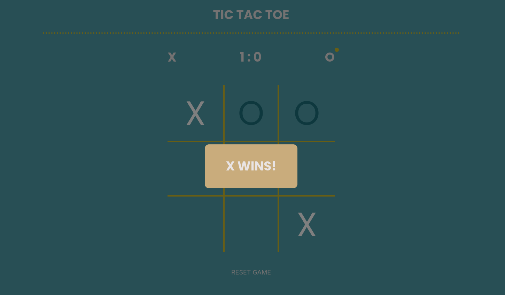
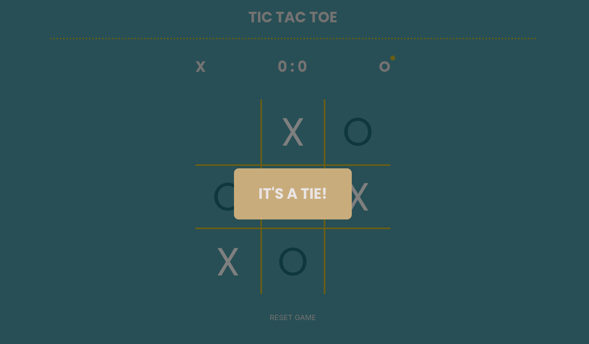
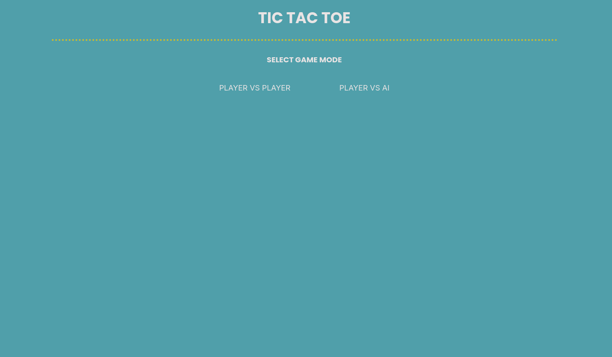

# Tic-Tac-Toe Game Specification

## UI Requirements

- **Game Board**: A 3x3 grid that displays the game state.
- **Score Counter**: A display area showing the current scores of both players (X and O).
- **Turn Indicator**: An area that shows whose turn it is to play.

## Turn / Starting-Player Rules

- **New Game**: Player X starts the game.
- After each round, the starting player alternates between Player X and Player O.
- Scores are updated based on game results:
  - Win: +1 point for the winner.
  - Draw: No points awarded.

## Round Lifecycle

1. **Game Start**: Initialize the game board and reset scores.
2. **Player Turn**: Allow the player to select a tile until the round ends.
3. **Check for Win / Tie**: After each move, check if there is a winner or if the game is a draw.
4. **End Round**: If there is a winner or the game is a tie, update the scoreboard and inform players.
5. **New Game Option**: Provide an option to start a new game.

## Win / Tie Detection

- **Winning Condition**: A player wins if they occupy three consecutive tiles in a row, column, or diagonal.
- **Tie Condition**: The game is a draw if all tiles are filled and no player has fulfilled the winning condition.

## Early Termination Logic

- Detect inevitable draws based on the current state of the board and terminate the round early if no further moves can lead to a win.

## Game end

- When the round ends, a modal is shown informing of the final outcome of the round (for examaple):
  - X wins
  - O wins
  - It's a tie

## Suggested Entities / Logic Structure

- **Engine**: Manages overall game logic and flow.
- **GameBoard**: Represents the current state of the board and handles input for player moves.
- **Tile**: Represents individual tiles on the game board.
- **Player**: Represents each player with associated properties (e.g., symbol, score).
- **Modal**: Represents the end-game info modal

## Suggested improvements

- You could try to implement a bot and a game mode selection before the start of the actual game (player-vs-player or player-vs-bot). At first your bot can place its pieces randomly.
- The bot can be upgraded to implement the `minimax` algorithm to achieve a virtually unbeatable bot that can only be tied at best
  - [Minimax article](https://www.geeksforgeeks.org/dsa/finding-optimal-move-in-tic-tac-toe-using-minimax-algorithm-in-game-theory/)
  - or you may generate the algorithm part too

## Suggested APIs
- DOM query and manipulation APIs for rendering the game board, updating scores, and showing modals (`document.querySelector`, `element.textContent`, etc.)
- Event handling APIs for capturing player moves and button clicks (`addEventListener`, etc.)
- Array manipulation methods for checking win conditions and updating the game state (`Array.prototype.some`, `Array.prototype.every`, etc.)
- `setTimeout` for adding delays when showing modals & transitioning between rounds (or to add a delay before the bot makes its move)
- `Object.freeze` for creating immutable objects representing enums of game constants

### Implementation Note:
When implementing the early termination logic, it is mathematically proven that if there are `> 3` empty tiles, then the game can still be won by either player.

# Images for reference

